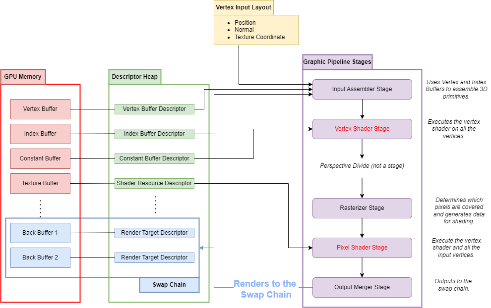
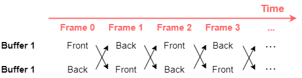
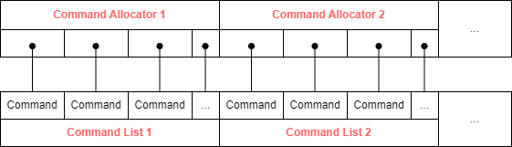
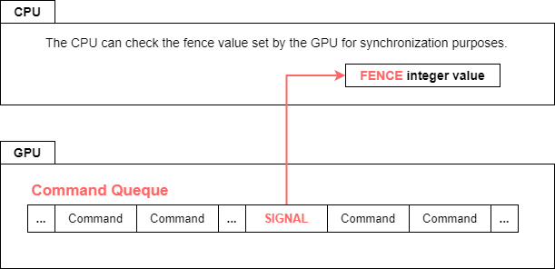

**This series is a collection of my personal notes as I review and study DirectX 12. I'm not an expert, but I'm documenting what I learn along the way to help solidify my understanding and possibly assist others who are also exploring this topic. These notes are informal and meant as a reference for myself, rather than a comprehensive guide.**

 

# Introduction to the Direct3D 12 Graphics API

This series of articles introduce to **Microsoft Direct3D (D3D) 12** programming. We will delve into the latest version of Microsoft's popular rendering API through a series of simple example implementations.

First, it's important to highlight that Direct3D 12 differs significantly from its predecessors. In pursuit of **efficiency** and **optimization**, many tasks that were previously automated are now the developer's  responsibility. As a result, Direct3D 12 is much more complex than its earlier versions.

This lesson covers the basics of Microsoft DirectX 12 programming. It begins with a summary of the key differences introduced in the latest version of the API, followed by an overview of the graphics pipeline, detailing its various components and their interactions within a 3D application.

From the next lesson we’ll start delving into the code. First, we'll implement a very simple application that draws a 2D triangle in a window, demonstrating the practical use of the concepts explained. You'll find that even this simple task requires significant effort. Gradually, additional features will be incorporated into our application, including animation, perspective, lighting, and texturing. Implementing these features will require you to apply all the concepts introduced in this first article.

This series of posts is ongoing, and the exact direction is still taking shape. A possible series of posts could be:

- ***Introduction to the Direct3D 12 Graphics API**: This one. Provides a ‘theoretical’ overview of the graphic pipeline like the pipeline stages, the vertex layout, the different types of resources and how are bound to the pipeline, the command queues, the root signature, and the pipeline state object.*
- ***First Direct3D Application**, Drawing a 2D triangle. Here, we start coding by creating the application window, setting up the graphics pipeline, and utilizing all the elements described in the first lesson. This includes implementing a very simple render loop and synchronization strategy.*
- ***Time Handling**: Adding 2D rotation to the triangle.*
- ***Vertex Buffer, Vertex Buffer Layout, Vertex Shader, and Constant Buffer**: Describing a more complex vertex layout with vertex colors, setting up the vertex buffer with a cube, and passing the model view matrix to draw a rotating cube in perspective.*
- ***Pixel Shader**: Adding normals to the vertex layout and implementing a simple lighting model in the pixel shader.*
- ***Texture Buffer**: Adding textures.*

## Key Differences Introduced in DirectX 12

Let’s start our journey with an overview of the key differences introduced in Direct3D 12:

- **No more immediate mode.** In previous versions of graphics APIs, drawing commands were submitted to the GPU for immediate execution, a method known as "immediate mode." In this approach, as soon as a command was issued, the GPU would execute it right away. With modern APIs like Direct3D 12, this has changed significantly. Now, instead of executing commands immediately, these are recorded in **command queues**,  and then executed at a **later time**. This process is known as "**deferred execution**." In this way the CPU can continue preparing additional commands without waiting for the GPU to finish executing the submitted ones.
- **Required Synchronization between CPU and GPU.** Since commands are submitted for deferred execution, the CPU must keep track of which commands have already been executed and which ones are yet to be executed, to properly update the resources according to the upcoming instructions.
- **Resource Management**: Allocating and managing resources such as vertex and index buffers, texture buffers and constant buffer, is now entirely the programmer's responsibility. Developers must ensure the correct uploading of these resources and provide detailed descriptions for each. Additionally, it is the programmer's duty to manage resource state transitions. For instance, they must configure transitions for a texture that switches from being a render target to being a resource used by a shader.
- **Pipeline State Object (PSO)**: The setup of the graphics pipeline involves instructing the CPU on how to use data for each vertex, binding shaders, determining the blending mode for newly rendered pixels with those already in the buffer, conducting depth and stencil tests, and more. Previously, these states were set and changed dynamically, which, while flexible, often resulted in performance overhead due to frequent state changes. Now, the Pipeline State Object (PSO) consolidates these states into a single object that is created once and set before rendering. This approach minimizes state transitions during execution, and different PSOs can be switched at runtime.

## Overview of the graphic pipeline

The purpose of the graphics pipeline is to process the assets and information that describe a 3D scene and render it on the render target. Assets include meshes, which are made up of vertices, edges, and faces that define shapes and structures. Information includes the model view matrix, light positions, textures, and material parameters

Before the pipeline can function, all these elements need to be set up and bound to it. Each frame, data flows through the pipeline, which consists of several sequential stages.

The following picture shows a simplified graphics pipeline with some resources bound to it.

 

  

 

When we review some of the graphics pipeline stages in the following paragraphs and explain how resources, such as vertex buffers, index buffers, shaders, and more, are bound, this image will serve as a reference.

### The Graphic Pipeline Stages

This section provides a brief description of each stage shown in the figure. To be precise, the D3D pipeline has additional stages, but they have been omitted for clarity since they are optional and will not be used in this introduction. 

An important difference in the graphics pipeline stages is that some are **configurable**, allowing parameters to be set to define their behavior, while others, like vertex and pixel shaders, are **fully programmable.**

- **Input Assembler:** This stage takes vertices and indices as input, assembling them into primitives like triangles or lines, and organizes the data for subsequent stages. It requires the **Vertex Input Layout** to understand how vertex data is stored in the vertex buffer. This stage is **configurable**, allowing specification of the primitive types to render, such as triangles or lines.
- **Vertex Shader**: This is a fully **programmable** stage. It is executed once for each vertex passed to it. While various effects can be implemented in the vertex shader, its primary purpose is to output the vertex coordinates in **clip space**, a **homogeneous coordinate** system used for clipping operations. These coordinates are then transformed into **Normalized Device Coordinates (NDC)** space by performing the **perspective divide**, which involves dividing the x, y, and z components by the w component. Clipping occurs after this conversion to NDC space, ensuring only the visible portions of objects are rendered.
- **Rasterizer**: This stage is **configurable**. The purpose of the rasterizer is to convert the primitives into **pixel fragments**. It performs **interpolation of vertex attributes**, such as color and texture coordinates, which are then passed to the next stage, the pixel shader.
- **Pixel Shader**: This shader is executed for each pixel, passing to it the interpolated data computed by the rasterizer. Here the **color of the pixel** is computed.  It is at this stage that lighting and texturing are applied. This stage is fully **programmable**.
- **Output Merger**: This is the **final stage** of the pipeline. Here, the output of the Pixel Shader is either discarded, blended with, or used to overwrite the color that is already in the render target.

Finally, the image rendered on the **render target** could be displayed on the output device. 

### The Resources Bound to the Graphic pipeline

The other important part shown in the previous picture, besides the stages, are the resources bound to the pipeline.

As we could imagine, several kinds of data are needed for the pipeline to render the final image. Here, we’ll give an overview of some of the resources that will be used in this article.

- **Vertex Buffer**: This buffer holds the list of vertices. The data contained in each vertex is specified in the vertex **Input Layout**, as shown in the figure. This can include position, texture coordinates, normals, or any other attributes defined by the application.
- **Index Buffer**: This buffer holds the indices of the face primitives in the vertex buffer. It is used to avoid repeating vertices shared among multiple faces, thus saving memory.
- **Constant Buffer**: This buffer stores values that remain constant across all stages of the pipeline. Examples include the model-view matrix, light positions, and material properties.
- **Texture Buffer**: This buffer holds textures used by the pixel shader.
- **Render Target Back Buffers** in the **Swap Chain**: These contain the render targets where the output merger will draw. We will briefly discuss the Swap Chain and its use.

All these buffers are essentially **memory portions accessible from the GPU**, filled with the required data. However, in D3D12, these resources cannot be directly bound to the pipeline. Instead, we need to define a structure called a **Descriptor** or **View**, which informs the pipeline about the type of data in the buffers, their structure, and their intended use. This level of indirection is necessary because a resource can serve multiple purposes.

For example, a texture might be used as a render target (a back buffer in the swap chain) but could also be read by a shader as an input texture. In such cases, we create two different descriptors for that buffer and use the appropriate one based on the situation.

As shown in figure, a descriptor should be created for each buffer we are going to use. Moreover, to make things more complex, some of these descriptors, such as those for constant buffers and texture buffers, need to be stored in a **descriptor heap**, which is a data structure that contains descriptors.

Constant and texture buffer views can be stored in the same descriptor heap.

In contrast, back buffers in the swap chain require a descriptor of type Render Target View (RTV) and are stored in a heap of type RTV.

Vertex and index buffer views are an exception and do not reside in a heap; they are bound to the pipeline in a different way.

To summarize:

- All the resources needed by the graphics pipeline are buffers that occupy some memory location.
- The type of resource in a buffer is described by a view, called a descriptor or view.
- Different types of resources require different types of views.
- Different types of views may require different types of descriptor heaps to be stored.
- Vertex and index buffer views are bound to the pipeline using commands, so they do not reside in descriptor heaps.

Be aware that there are other kinds of resources, but they are outside the scope of this article.

### The Root Signature

We have created all the buffers, their views, and placed them in the descriptor heap. Now, what’s next? It's time to **bind them to the pipeline** using another crucial object: the **root signature**. The resources and their views are not automatically bound to the pipeline. Different pipelines could use different resources. As we stated, one of the strong points of modern graphics APIs is that we can have several **Pipeline State Objects** (PSOs) and switch among them. 

The **root signature defines all the resources that are bound to the pipeline** *(NOTE: I THINK I SHOULD ADD THE ROOT SIGNATURE TO THE FIGURE).*  ****In the root signature, we specify a list of all the views we are going to use and their types, such as Constant Buffer Views (CBVs) or Shader Resource Views (SRVs). This allows the pipeline to access these resources as needed. By using root signatures, we can efficiently manage and switch between different sets of resources.

### The Pipeline State object (PSO)

Finally, we can consolidate all the previous setups, such as buffers, views, descriptors, and root signatures, into the **Pipeline State Objects** (PSOs), that encapsulates the entire configuration of the rendering pipeline. This approach is more efficient than previous APIs, avoiding complex and slower state changes.

## Swap Chain, Double Buffering  and V-Sync

As shown in the fist figure, the output of the output merger stage, that is the final pipeline stage. is the render image. If this new frame were displayed on the monitor without waiting for the rendering process to complete, the screen will show parts of the new frame alongside the parts of the old frame that haven't been updated yet. This discontinuity in the output image, is an artifact called **tearing**.

To avoid it, it is common practice to use **two buffers**. The first buffer, called the **back buffer**, is where the rendering happens and serves as the render target. The second buffer, called the **front buffer**, is the one displayed on the screen.

When rendering of a frame is finished, the back buffer is **swapped** with the front buffer, inverting their roles. Then the front buffer is **presented** on the output device. The front and back buffers are managed by a structure called the **Swap Chain**.

This process is illustrated in the following picture:

 

  

 

However, having two buffers is not enough; they must be swapped precisely when the monitor finishes drawing the current frame and is ready to start the next. This synchronization, done by waiting for the **v-sync event**, prevents tearing that occurs if buffers are swapped mid-frame.

Using the D3D API, we can choose to ignore v-sync and present the buffer as soon as it is rendered. This approach increases the frame rate but comes at the cost of introducing tearing.

## Command Queues, Command Lists and  Command Allocators

As we already pointed out in the introduction, one of the most important changes in modern 3D APIs is the removal of immediate mode. Instead, commands are added to **command queues** for **deferred execution**. Anyway, commands are not added directly to the queue; instead, **command lists** are filled with commands, and then the entire list is added to the queue.
The commands are of different kinds: they can be **drawing** commands, **resource management** commands, or commands to **set the viewport**, and more. For example, drawing commands might render a mesh, resource management commands might upload textures to the GPU, and viewport commands might define the area of the screen to draw on.
As we mentioned, modern 3D APIs are quite complex, and command lists in turn require **command allocators** to manage the memory regions where the commands are stored. Think of the commands in the list as references or pointers to the memory where the actual command data is stored, which is managed by the allocator. 

The following image shows a command queue that contains several command lists. In each one have been recorded several commands, which data are contained in the allocator associated with the list.

 

  

 

The required workflow is:

- Create the command allocator.
- Create the command list associated with the allocator.
- Record the new commands into the list.
- Submit the list to the queue for later execution.
- Once the commands have been executed, the allocator can be reset and its memory reused.
- The command list can be reset and new command recorded as soon as it has been submitted.

### CPU/GPU synchronization: the Fence

As we saw in the previous section, commands are added to the command queue for deferred execution. This introduces the need for **synchronization between the CPU and GPU**. The CPU must ensure that certain commands have been executed on the GPU before submitting new ones. Additionally, it is responsible for making available all the resources needed by the commands when required. For example, the CPU might need to wait for a texture upload to complete before issuing a draw command that uses that texture. Similarly, it must ensure that previous render targets are fully processed before they are reused or overwritten.

To manages synchronization we use a **fence**, an **integer variable** that can be observed by the CPU and **set by enqueueing the signal command** in the command list. Then, when the signal command is executed, it updates the fence value. The CPU can then check that value to determine if the GPU has reached the desired point in execution.

The following image illustrates a point in the command sequence where a signal is sent to set a specific fence value. The CPU can check this value to determine when all commands up to that point have been executed.

 

  

 

## Conclusion

So, we have overseen how many D3D objects are involved in a frame rendering. There are many more details, but the information you have acquired is enough to write a simple application. Don’t worry if you miss something or don’t remember all the concepts. 

To recap:

- The graphics pipeline consists of many stages that take input data buffers containing vertices, constants, and textures, and process them to produce the rendered output.
- The vertex data is configurable using the input layout.
- All required resources are stored in buffers, which need descriptors to be bound to the pipeline.
- Descriptors are organized in descriptor heaps.
- All the descriptors used from the pipeline are listed in the root signature.
- The root signature, vertex input layout, and configuration of the configurable stages are consolidated in the Pipeline State Object (PSO).
- The back buffers are managed using the swap chain.
- Commands are enqueued in lists for later execution.
- The CPU and GPU are synchronized using a fence.
- After primitives are assembled at the beginning of the pipeline, the data flows through different stages, which can be configured with commands or programmed, like the vertex and pixel shaders.
- Finally, the image is rendered to the target output buffer.

 
	
*That's it for now. See you next time !!!*