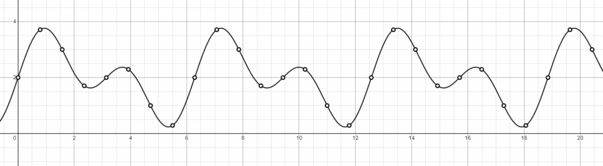

**This is a brief introduction of the main topics that will be elaborated during the series: signals, sampling, filtering and aliasing.**

{}
In this pages you'll find some shaders written with [Shadertoy](https://shadertoy.com/ "ShaderToy"), and some [Desmos](https://desmos.com/ "Desmos") graphs. 
[Read how to use the interactive content in this site](/post/howto-interactive-content).
{}

 

## What is a signal
A **Signal**, broadly speaking, is any **quantity that vary in space or time**. 

An example is the function $f(t) = \sin 2t  + \sin t + 2$, where the $t$ variable is the **time**. It is defined for each value of $t$. So it is a **one dimensional continuous time signal**.

A signal it's not limited to one dimension. The following function $f(x,y) = (\lfloor {x} \rfloor + \lfloor {y} \rfloor) \bmod 2$, gives us a checkboard pattern.
It is a function of two values $x,y$ so it's a **two dimensional signal**.

A checkboard pattern, a 2D signal |
--------|
	<iframe width="100%" height="360" frameborder="0" src="https://www.shadertoy.com/embed/sl3cRX?gui=true&amp;t=10&amp;paused=false&amp;muted=false" allowfullscreen=""></iframe>
	
 

## Sampling
**Sampling** means to take samples of the continous signal at **discrete intervals**. This allows to store it as an array of numbers, 
which can be easily loaded into a computer memory or saved on a storage. Sampling often occurs at uniform intervals, as shown in the following picture:

As another example, sampling the previous checkboard pattern, we get an image made of pixels, that is a discrete representation of the function we have seen before.

 

## Reconstruct a signal from its samples: filtering
Reconstruct a continuous version from the discrete samples it's called **filtering**, that makes use of mathematical functions called **filters**.
This is needed to get also the values that are **between the samples**.

The next illustration shows a possible reconstruction, in blue, of a one dimensional signal. 
It has been obtained "connecting" the discrete samples, and it's not perfect because it's **slightly different from the orginal**.
Under some ideal conditions it's **possible to achieve perfect reconstruction**, but practically this never happens, and some artifacts are always introduced during the process.

 

## Aliasing
A continuous signal can be **perfectly reconstructed** only under some conditions, otherwise it shows artifacts called **alias**. 
For example if the sampling frequency is too low, simply there aren't enough samples to get the original signal back.

In the next picture the reconstructed signal in blue is very different from the original for this precise reason.

## Anti-aliasing
The aim of **anti-aliasing algorithms** is to **avoid or reduce the alias**. Many are commonly employed in Computer Graphics: **SuperSampling (SSAA), MultiSampling (MSAA)** and **Temporal Anti-Aliasing (TAA)**, 
to name a few.

The following figure shows a raytrace image without any anti-aliasing on the left, and with the SuperSampling anti aliasing on the right.

 
	
*That's it for now. See you next time !!!*