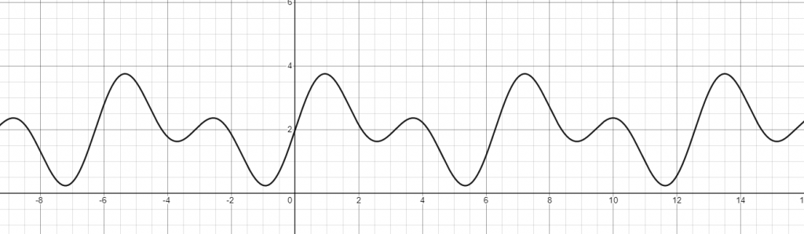

**Let's introduce the definition of signal, and some of the properties used to describe it.**

{}
In this pages you'll find some shaders written with [Shadertoy](https://shadertoy.com/ "ShaderToy"), and some [Desmos](https://desmos.com/ "Desmos") graphs. 
[Read how to use the interactive content in this site](/post/howto-interactive-content).
{}

 

## What is a signal
As stated in the [Introduction](/post/aliasing-antialiasing/2-introduction) a **signal**, broadly speaking, is **any quantity that vary in space or time**. 
Let's see some examples.

 

### One dimensional signal
A simple example is the $sin(x)$ function: a function of one variable, defined for each real value. It is a **continuous time one dimensional signal**. 
It repeats identically each $2\pi$, so it's **periodic**, and $2\pi$ is it's **period**. This latter is releated to the **frequency**, defined as:

$$frequency = \frac{1}{period}$$ 

that is the **number of complete cycles per seconds**.

> Think to a signal that repeat identically every 2 seconds (**period**), it means that he does 1/2 cycle every second (**frequency**).

The **amplitude** of a signal is of how much it extends from the top to the bottom. The signal can also be **shifted**, vertically or horizontally.

The following graph shows the function $sin(x)$. You can tweak some paramer and modify its period and frequency, it's amplitude and shifts.

<iframe src="https://www.desmos.com/calculator/osxsx5te5i" width="100%" height="400" style="border: 1px solid #ccc" frameborder=0></iframe>

 

### Two dimensional signal

A signal doesn't have to be limited to one dimension. Indeed it could have any. 

The function $$f(x,y) = (\lfloor {x} \rfloor + \lfloor {y} \rfloor) \bmod 2$$ that gives us a checkboard pattern, it's an example of a **two dimensional signal**.

A checkboard pattern, a 2D signal |
--------|
	<iframe width="100%" height="360" frameborder="0" src="https://www.shadertoy.com/embed/sl3cRX?gui=true&amp;t=10&amp;paused=false&amp;muted=false" allowfullscreen=""></iframe>
	
 

## The frequency domain
Usually a signal is the sum of several frequencies. For example consider the following function: $$f(x) = sin(2x) + sin(x) + 2 $$.

This is the sum of two $sin$ functions, one with $\frac{1}{2\pi}$ and one with $\frac{1}{\pi}$ frequency. 

A signal represented in the **frequency domain** is a plot of all the frequencies which it is made up, differently from the representation seen until now, that is in the **time domain**,
considerint the independent $x$ variable as the time. 

The mathematical tool used to transform a signal from the **time domain** to the **frequency domain** is the **Fourier Transform**. 
Here, from the [3Blue1Brown channel](https://www.youtube.com/c/3blue1brown), there is a [great explanation of the fourier transform](https://www.youtube.com/watch?v=spUNpyF58BY).

If a signal has no frequencies over a maximumum value, it's **bandlimited**. 

It's really important to see a signal from the perspective of the frequencies domain. Indeed the aliasing come from insufficient sampling, compared to 
the maximum frequency, of from sampling signals that are not bandlimited.

 
	
*That's it for now. See you next time !!!*