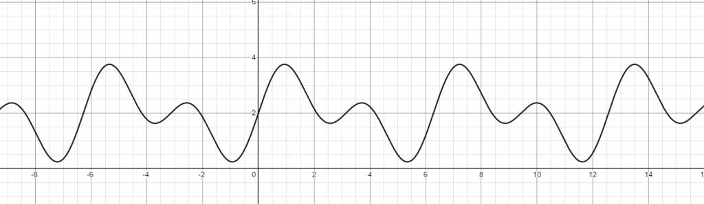
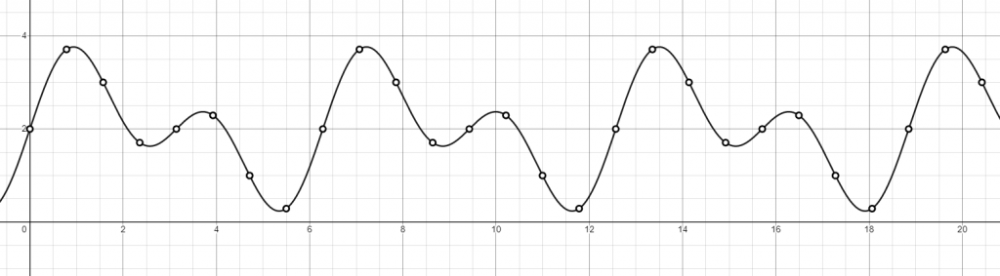

**Sampling means to take samples of the continous signal at **discrete intervals**. Filtering is the opposite operation: reconstructing the continuous time signal from
its discrete samples.**

{}
In this pages you'll find some shaders written with [Shadertoy](https://shadertoy.com/ "ShaderToy"), and some [Desmos](https://desmos.com/ "Desmos") graphs. 
[Read how to use the interactive content in this site](/post/howto-interactive-content).
{}

 

## Sampling a signal at discrete intervals
**Sampling** means to take samples of the continous signal at **discrete intervals**. This allows to store it as an array of numbers, 
which can be easily loaded into a computer memory or saved on a storage. Sampling often occurs at **uniform intervals**, as shown in the following picture:

As an example to illustrate sampling and filtering consider the following function:

 $f_{Signal}(x) = sin(2x) + sin(x) + 2 $ 
 

.

This function is continuous with **period** $ T= 2\pi $ and **frequency $ F = 1/T = 1/2\pi $**.

As sum of two $sin$ functions the **maximum frequency in the signal is $1/\pi$**, that is the frequency of $sin(2x)$. 

Now sample this signal with a rate of **4 times** this maximum frequency, as illustrated in the following picture. 

.

> A foundamenmtal result in signal processing is the **Nyquist–Shannon sampling theorem**: the sampling frequency has to be **more than the double of the maximum frequency** in a 
bandwidth-limited signal in order to obtain a **perfect reconstruction**. Anyway this perfect reconstruction occurs **only if the ideal sinc filter is used**.

 

## Reconstructing the continuous-time signal from its discrete samples

**Convolving a filter function** with the discrete samples reconstructs a continuous-time signal. In the following Desmos graph three filters are used: **Box**, **Tent** anc **Sinc**, 
Note that the quality of the recostruction is different according to the filter used.

## The box filter
This filter is shown in the next graph:

<iframe src="https://www.desmos.com/calculator/qerzonkacq" width="100%" height="500"></iframe>

This is the worst filter: a recostruction made with it has high frequency artifacts, the "steps" of the recostructed function. Anyway it's really fast and pratical.

<iframe src="https://www.desmos.com/calculator/qcimfux1da" width="100%" height="500"></iframe>

## The tent filter

The next is the tent filter:

<iframe src="https://www.desmos.com/calculator/irddopjidk" width="100%" height="500"></iframe>

This filter is better then the Box, anyway the reconstructed signal is still not smooth. Applying a tent filter is the same as **linear interpolate** between the sampled points.

<iframe src="https://www.desmos.com/calculator/utvcbbfawd" width="100%" height="500"></iframe>

## The sinc filter

The Sinc filter assures a **perfect recostruction** of a bandwidth-limited signal, if the sample rate is more than the double of the maximum frequency in the signal. 

<iframe src="https://www.desmos.com/calculator/jpb1p2mqss" width="100%" height="500"></iframe>

We can see in the following demo how the recostruction  made at four time the maximum frequency is **nearly perfect**. Anyway using the sinc filter is **impratical** in real
world application, because its domain extends from $-\infty$ to $\infty$. 

<iframe src="https://www.desmos.com/calculator/exctrhdwkx" width="100%" height="500"></iframe>

 
	
*That's it for now. See you next time !!!*