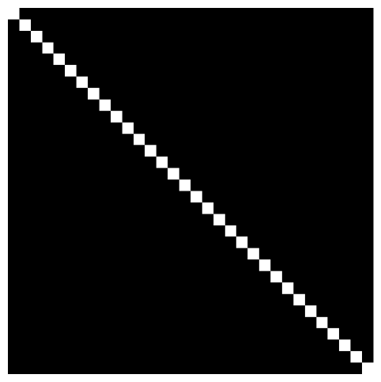
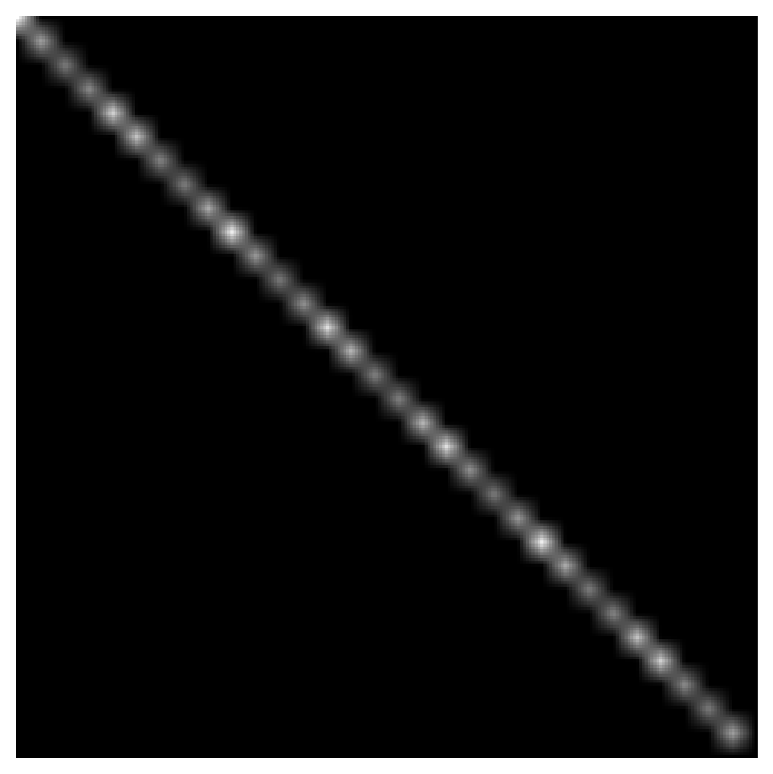

As we've seen before, aliasing happens when the sampling rate is too low to properly reconstruct the original signal. 
With computer-generated images, it happens because these images come from a mathematical continuous description of the 3D scene. 
The signal we're trying to display isn't bandwidth-limited, so aliasing is bound to happen when we put it on the screen.

## Example: Diagonal Line

For example, imagine drawing a straight diagonal line on the monitor. The line looks jagged, like a staircase, instead of being smooth. 
There's actually one continuous line going through the diagonal, but since the pixels are pretty big, we end up seeing 'blocks' that approximate it. 
This happens because the monitor's resolution is limited, so we can't perfectly reconstruct the line, and aliasing shows up. In this example, 
let's say that a pixel is the size of one block.

## Texture and Filtering

Now image that the previous diagonal line image is stored as a texture. So it's essentially a sample an image that originates from a higher bandwidth signal. 
The original line is not jagged, but it contains more details and higher frequencies than what can be captured at the sampling rate used to create the texture. 
So when we use this texture, we lost some of that detail, so we want to use same filters, like we saw in the previous chapters, to try to reconstruct the orginal signal.

The filters that usually come directly from graphics APIs are the following:

- **Nearest Neighbor Filtering**
- **Linear Filtering**
- **Mipmap Filtering**

### Nearest Neighbor Filtering

This is basically the box filter we saw in chapter #4. It is the simplest type of texture filtering, where the texel closest to the specified texture coordinate is 
used directly. No blending is done, and intuitively, this filter manipulates the data the least after sampling, keeping it as close as possible to the 
original values sampled. In the case of the diagonal line example, using nearest neighbor filtering results in the jagged 'staircase' effect, 
as each pixel is either fully on or off, creating sharp transitions without any smoothing.

### Linear Filtering

This is instead the tent filter we saw in chapter #4. It works by linearly interpolating between neighboring texel values to produce a smoother result. 
The interpolation helps to reduce the harsh edges seen with nearest neighbor filtering, providing a more visually appealing transition between pixels.
Essentially, the filter takes a weighted average of the texels around the sampled point, which results in smoother gradients and reduced jaggedness. 
In the diagonal line example, using linear filtering softens the 'staircase' effect by blending the pixel values, leading to a line that appears less blocky and more continuous.

### Mipmap Filtering

Graphics APIs often provide built-in support for generating mipmaps. A mipmap is essentially a series of progressively smaller versions of the original texture, 
each level downsampled by half. This set of textures allows the rendering engine to pick the most suitable texture resolution depending on the distance of the object from the viewer. 
This helps maintain visual quality and reduce aliasing artifacts, particularly when textures are viewed at steep angles or from a distance. 
Many APIs can automatically generate mipmaps when a texture is loaded, making it easy for developers to implement without manually creating each level.

 

*In the next chapter we'll see some anti aliasing methods. See you there !!!*