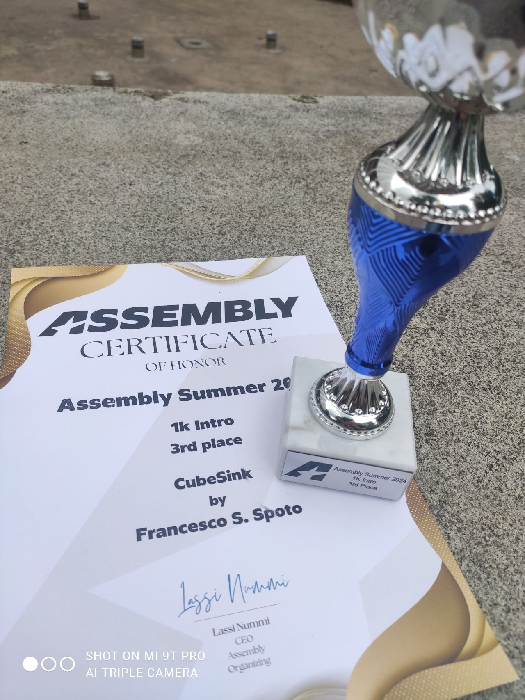

**Assembly Summer '24** has come and gone, and I had the great joy of seeing my little 1k intro on the big screen and see some living legends of the Demoscene.

I also took **3rd place** in the compo, which isn't bad at all.

This is the ShaderToy version of the 1kb demo I presented:

CubeSink |
--------|
	<iframe width="100%" height="600" frameborder="0" src="https://www.shadertoy.com/embed/Mffyzf?gui=true&t=10&paused=false&muted=false" allowfullscreen></iframe>
	

*See you next year with more incredible demos, Assembly!*

{}
On this page you'll find shaders written in [Shadertoy](https://shadertoy.com/ "ShaderToy") and functions graph made in [Desmos](https://desmos.com/ "Desmos"). 
[Read about use the interactive content in this site](/post/howto-interactive-content)
{}

