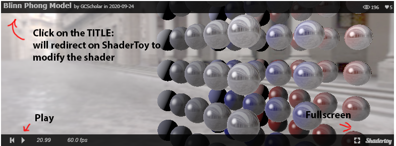

**How use the interactive content that you'll find in this website.**

{}
In this page you'll find some shaders written with [Shadertoy](https://shadertoy.com/ "ShaderToy") and [Desmos](https://desmos.com/ "Desmos") graphs.
{}

## ShaderToy

A **Shadertoy shaders** is a shader written on [Shadertoy](https://shadertoy.com/) using the GLSL language. Putting the mouse **over the shader image will show a minimial interface**. 
Clicking on the **play button** will start the shader, if not in play state already. 

Clicking on the **title** on the top of the shader will redirect you to a page 
where you can **modify the code in real time**. Feel free to play with all the shaders, make modifications and see the results.

 

ShaderToy shader |
--------|
	<iframe width="100%" height="360" frameborder="0" src="https://www.shadertoy.com/embed/3d3cWN?gui=true&t=10&paused=false&muted=false" allowfullscreen></iframe>
	
 

## Desmos

A **Desmos graph**: is an interactive graph of one or more mathematical functions you can modify just rewriting them in the box on the left.

<iframe src="https://www.desmos.com/calculator/qblbmqu0ln" width="100%" height="300" style="border: 1px solid #ccc" frameborder=0></iframe>
