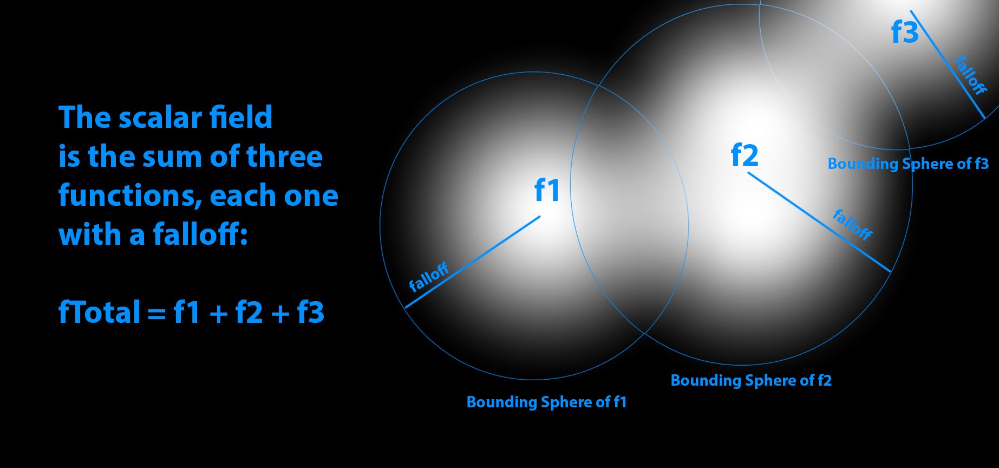
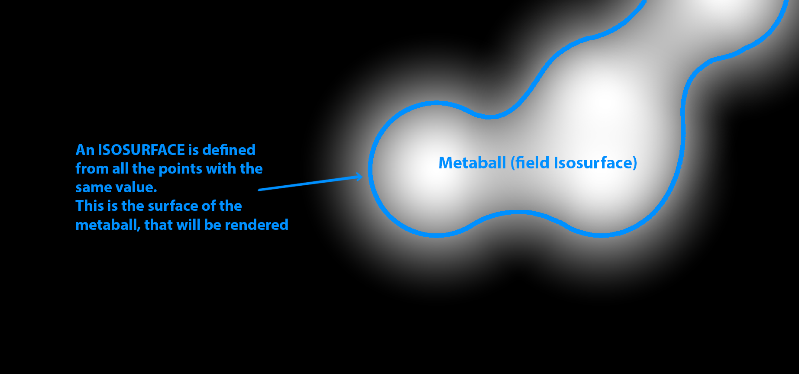
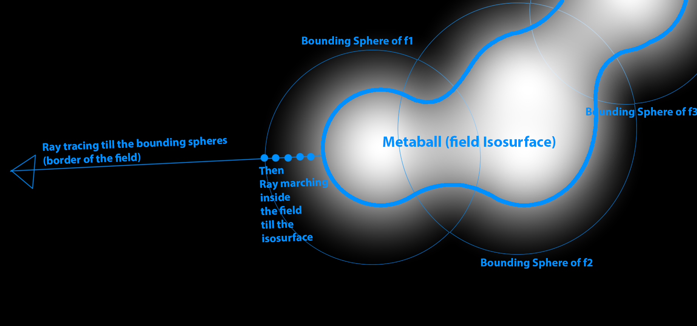

<script>
    document.addEventListener("DOMContentLoaded", function() {
        renderMathInElement(document.body, {
            delimiters: [
                {left: "$$", right: "$$", display: true},
                {left: "$", right: "$", display: false}
            ]
        });
    });
</script>

**3D Metaballs are a valuable tool for modeling "blobby shapes", or something that should look "organic". They could even be used for fake fluid simulations. 
In this article, we'll explore how to render Metaballs in 3D, using ray casting tecniques.**

The <cite>Metaballism [^1]</cite> video series by *Alexander Mitzkus* showcases the versatility of metaballs in 3D graphics.

If you're new to metaballs, it's recommended to read the previous article in the series,
[Rendering Metaballs in 2D](/post/meta-balls).

{}
In this page you'll find some shaders written with [Shadertoy](https://shadertoy.com/ "ShaderToy"), and [Desmos](https://desmos.com/ "Desmos") graphs. 
[Read how to use the interactive content in this site](/post/howto-interactive-content).
{}

The code in this article is took from the shader below, an implementation of **Metaballs** I made in ShaderToy:

3D Metaballs |
--------|
	<iframe width="100%" height="400" frameborder="0" src="https://www.shadertoy.com/embed/NlGcDh?gui=true&t=10&paused=false&muted=false" allowfullscreen></iframe>
	
<br />
	
# Rendering metaballs in 3D
Rendering Metaballs in 3D is more complex than in 2D, but can be achieved using **ray casting** tecniques. **Colors** and **shading** enhance the perception
of three-dimensionality, while animation creates dynamic shapes that continuously glue and split.

<br />

## Isosurfaces of a 3D scalar field 
Similar to 2D Metaballs

> **3D metaballs are isosurfaces of a three dimensional scalar field.**

The field in 3D is defined as the **sum of 3D scalar functions**, each one of them has its own **falloff**. The following picture shows an example of a the scalar field that is the sum of three functions: $f1, f2, f3$
(Just imagine that this is a section of the the 3D space :). The value of each on decreases as the points are far from its "center".
 

An **isosurface** is made from **all the points in space that have equal value**. The next figure shows an example (imagine that is a section in 2D :).
The isosurfaces of a value of choice, are the metaballs that will be rendered. Chosing **small values will make big metaballs**, and vice versa.
 

The following code illustrates the definition of the field function. The position is the center of the function (its greatest value), while the **radius** is the lenght of the falloff.
In this example eight fields are defined. 

```glsl
// A field function
struct Field
{
    vec3 position;
    float radius;
};

// Define the number of functions (scalar fields) that generate the total field
#define N_FIELDS 8
Field fields[N_FIELDS] = Field[N_FIELDS]
(
     Field(vec3(0,0,0),1.)
    ,Field(vec3(0,0,0),2.)
    ,Field(vec3(0,0,0),3.)
    ,Field(vec3(0,0,0),4.)
    ,Field(vec3(0,0,0),5.)
    ,Field(vec3(0,0,0),2.)
    ,Field(vec3(0,0,0),3.)
    ,Field(vec3(0,0,0),4.)
);
```

The following snippet computes the total field, summing up all the functions. It uses *getFallOff()* to get the value at a specific distance from the center. 
The falloff will be defined in the following section.

```glsl
    float f, df;
    value = 0.;
    
    // Compute the total field summing all the scalar field ...
    for(int i=0;i<N_FIELDS;i++)
    {
        // The distance from the center of the field
	float r = length(p-fields[i].position);
       
        // The distance from the center of the function is normalized with the radius of the field
        float d = length((p-fields[i].position)/fields[i].radius);
        
        // Get the value of the falloff ...
        getFalloff(d, f);
        
        // ... and sum it to the total
        value += f;        
    }
```

<br />

## The falloff function
In 2D we used a cubic polynomial. In 3D instead it's better to choose the **quintic polynomial** $$f(x) = 1 - (6x^5 - 15x^4 + 10x^3)$$.
It **has the first and second derivative equals to zero**, so we can avoids discontinuities in the isosurfaces normals <cite>[^2]</cite> <cite>[^3]</cite>. 

The following graph shows a comparison of the quintic and the cubic falloffs.

<p><iframe src="https://www.desmos.com/calculator/kroetcubyc" width="100%" height="400" style="border: 1px solid #ccc" frameborder=0></iframe></p>

These polynomials are defined in the interval [0,1], and have a value of $0$ outside of it. It is possible to modify the lenght of the falloff multipling the argument $x$ for a value. 
If $value<1$, the falloff become larger, otherwise it shrinks.

```glsl
// Get the value of the falloff function for a value of x in [0,1]
void getFalloff(float x, out float f)
{
    f = 0.;
    if(x<0.01||x>1.) return; // Field is 0 outside [0,1]
    
    // Quintic falloff 1-6x^5 - 15x^4 + 10x^3
    f = 1.-(x*x*x*(6.*x*x-15.*x + 10.));
}

// Get the falloff derivative
void getFalloffDerivative(float x, out float df)
{
    df = 0.;
    if(x<0.01||x>1.) return; // Field is 0 outside [0,1]
   
    // Quintic fallof derivative 1-(30x^4 - 60x^2 + 30x)
    df = -(x*x*(30.*x*x - 60.*x + 30.));
}
```

<br />

## Ray tracing the bounding spheres
Bounding spheres are used to optimize ray tracing. These spheres encapsulate the Metaballs and allow for efficient boundary detection. 
Ray tracing determines the hit point on these bounding spheres.
The next picture illustrate this concept:



The next snippet implements this optimization. The function **traceSphere** is defined in the ShaderToy shader.

```glsl
// Ray trace the bounding sphere and returns the hit point (if any)
Hit rayTraceFieldBoudingSpheres(vec3 origin, vec3 dir)
{
    float minT = INF;
    float point;
    Hit hit, result;
    
    // Get nearest point from the spheres
    result.t = INF;
    for(int i=0; i<N_FIELDS; i++)
    {
        if(traceSphere(origin, dir, fields[i].position, fields[i].radius, hit) && hit.t<result.t) 
        {
            result.t = hit.t;
            result.point = origin + result.t*dir;
            result.objId = 1;
        }
    }
    
    return result;
}
```

<br />

## Ray marching inside the field
**Ray marching** is employed inside the scalar field to locate the isosurface. By taking small steps along the ray direction, the field value is computed at each step. 
When the desired isosurface value is reached, the normal and shading are computed.

The following code illustrates the ray marching.

```glsl

// Cast a ray into the scene
vec3 castRay(vec3 origin, vec3 dir)
{
    // Update the position of the fields in the scene
    updateField();
    
    vec3 fieldNormal;
    
    float MAX_DISTANCE = 20.;
    int MAX_ITERATIONS = 200;
    
    // getDistanceToField Ray-Trace the field spheres bounding boxes Get to the field nearest point, ray
    Hit hit = rayTraceFieldBoudingSpheres(origin, dir);
    
    // Ray march inside the scalar field
    float t = hit.t;
    if(t==INF) return vec3(1); // No hit -> return white background
   
    vec3 p;
    vec3 color;
    float value=0.;
    float threshold = 0.4;
    for(int i=0; i<MAX_ITERATIONS; i++)
    {
        if(t>MAX_DISTANCE) break; // No hit
		
		// Take little stesp inside the field
        t+=0.05;
        p = origin + t*dir;
        
		// Get the field value, normal and color
        if(getFieldValues(p, threshold, value, fieldNormal,color))
        {
            hit.t=t;
            hit.point=p;
            hit.normal=fieldNormal;
            hit.objId=1;            
            hit.color=color;
            break;
            
        }
    }
    
    // If the ray didn't intersect the isosurface (here I choose the value 0.4)
    // -> return white background 
    if(value < 0.4) return vec3(1); 
    
    return render(origin,hit);
}
```

<br />

## Computing the normals
The normals to the isosurface are equal to the **sum of each function normals**. All the normals have the direction from the function center to the application point.
The magnitude is equals to the derivative of the falloff function.

```glsl
    
    // If the value of the field is greater than threshold we reach the isosurface,
    // so compute the normal
    if(value>=threshold)
    {
        float df=0.;
        
        // The resulting normal is the sum of all the gradient of the fields function summed up.
        // The gradient of a single field is the derivative of its falloff in this point (that is a scalar)
        // multiplied the normal vector to the surface, that is the differece between the current position 
        // and the center of the field (it's a spherical field).
        for(int i=0;i<N_FIELDS;i++) 
        {
            // Get the value of the falloff derivative in this point ...
            float d = length((p-fields[i].position)/fields[i].radius);
            getFalloffDerivative(d, df);
            
            // Compute the normal of this specific field in this position and sum to the others
            normal += df*normalize(fields[i].position-p);
        }
        
        // Normalize the result
        normal = normalize(normal);
        
        return true;
    }
```

<br />

## Rendering the metaballs
Shading is applied to the Metaballs using a simple shading model that considers diffuse, specular, and Fresnel contributions.
The shading is implemented in the *render()* function.

<br />

## Animating the metaballs
Animating Metaballs involves changing the positions of the functions that generate the field over time. This animation creates **dynamic, evolving shapes**.

```glsl
// Update the position of the objects in the scene
void updateField()
{
    for(int i=0; i<N_FIELDS; i++)
    {
        float id = float(i);
        float a = 2.;
		
        // Just change the position of each function using a random combination of sin, cos, *, +  and scalar values
        fields[i].position = vec3(a*sin(float(iFrame)/200.+id*244.),1.4*abs(sin(id*0.1*iTime+323.3))-1.,a*sin(float(iFrame)/100.+id*1724.)) * 2.;   
    }
}
```

<br />

## Experimenting with it
With the basics covered, there are endless possibilities for experimentation. 
For example, different functions can be used to generate the field, leading to unique visual effects. 
The provided ShaderToy shader includes additional features, such as a field generated from a plane, for further exploration.

<iframe width="100%" height="400" frameborder="0" src="https://www.shadertoy.com/embed/NttyRs?gui=true&t=10&paused=true&muted=false" allowfullscreen></iframe>
	

<br />
<br />
<br />
	
*That concludes our guide to rendering 3D Metaballs using ray casting techniques. Experiment with the provided shaders and explore the creative possibilities of Metaballs in 3D graphics.*

[^1]: Metaballism Ep. 1. https://www.youtube.com/watch?v=PP14rVhgX9M.
[^2]: Ryan Geiss "Guide to Metaballs" http://www.geisswerks.com/ryan/BLOBS/blobs.html
[^3]: Inigo Quilez "Metaballs - Quintic" https://www.shadertoy.com/view/ld2GRz
