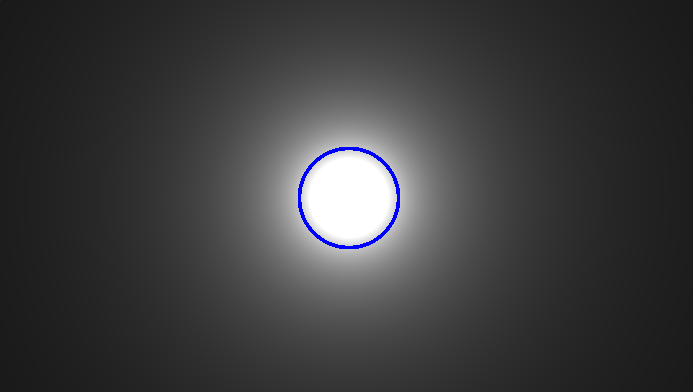
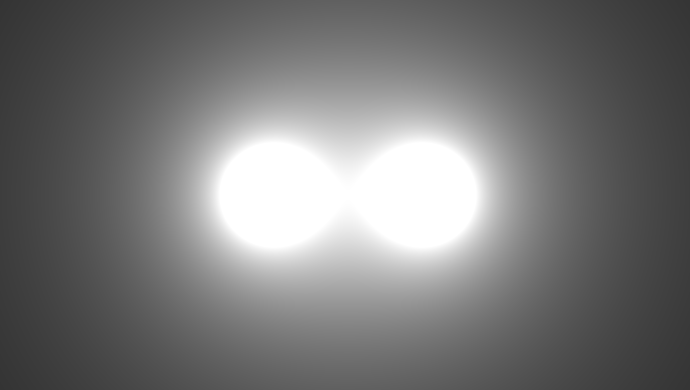
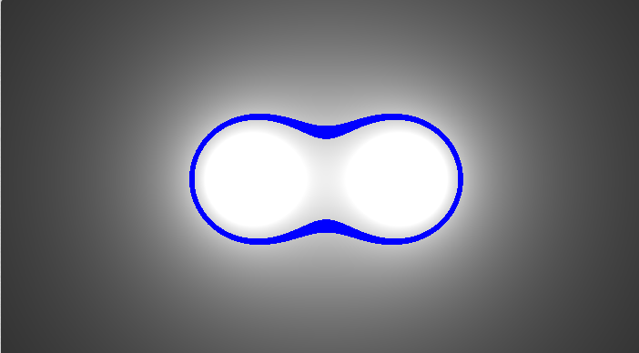

**Metaballs are blobby objects that "glue togheter" when they came close. They were Invented by Jim Blinn for the 1980 documentary TV show Cosmos to represent atoms and molecules. 
Metaballs later became a popular effect in the demoscene in the early 90s. In this article we'll see how render them in 2D.**


{}
In this page you'll find shaders written with [Shadertoy](https://shadertoy.com/ "ShaderToy") and [Desmos](https://desmos.com/ "Desmos") graphs. 
[Read how to use the interactive content in this site](/post/howto-interactive-content).
{}

 If you're curious, there is a link in the References section to the original episode of <cite>Cosmos [^1]</cite> where the metaballs were used for the first time.
[^1]: Cosmos Ep. 2. https://youtu.be/SYpYB2f9kGk?t=2419. To give an idea what we are talking about, the following is an example implementations I made in ShaderToy:

2D Metaballs |
--------|
	<iframe width="100%" height="460" frameborder="0" src="https://www.shadertoy.com/embed/3s3yWf?gui=true&t=10&paused=false&muted=false" allowfullscreen></iframe>

<br />

## Isolines of a scalar field 
Figure 1 show the output of the function of two variables:

$$f(x,y) = \frac{1}{r}$$ 

where r is the **distance from the orgin**, computed as $r=\sqrt{x^2+y^2}$. The higher values correspond to brighter pixels, which become darker as the distance from $(0,0)$ increases.
The output of such a function is called a **scalar field**.

<br />

One scalar field | The metaball |Two fields summed | The metaball
--------|-|-|-
 |  |  |  

Now we can define the metaball as:

>*The portion of the scalar field where its value is above a threshold.*

Figure 2 shows in blue the pixels with the value of the threshold we choose, this is called an **isoline**. 
All the pixels **inside the isolines** are part of the metaball.

**Translating** the function slightly to the left and adding another one equal to it on its right (Figure 3), generate a scalar field that is the **sum of both**, and a new isoline.

Moving one function with respect to the other will result in a countinous change of the isolines, which "glue togher" when they came close, as shown in the following shader.

<p><iframe width="100%" height="360" frameborder="0" src="https://www.shadertoy.com/embed/7tGyDR?gui=true&t=10&paused=false&muted=false" allowfullscreen></iframe><p/>

<br />

## The falloff function
$f(x,y) = \frac{1}{r}$ is **inversely proportional** to the distance from the origin. For this reason we'll call it the **falloff**.

This particular funciton isn't the best choiche for some reasons:

* It's $+\infty$ in the origin, so we have to **clamp** it.
* There is a **division** that is expensive (at least on old hardware :))
* It never became zero, so we have always sum up all the functions to compute the field, no matter how far.

The following Desmos graph shows in the falloff in one dimension, as function of the distance from the origin $r$. In *red* the previous one and in **blue** the clamped version.

Actually we will use the **green** one, a **cubic polynomial** $f(r) = 1-(3r^2-2r^3)$, where $(3r^2-2r^3)$ is also known as the **smoothstep** function.

<p><iframe src="https://www.desmos.com/calculator/xllx6tmhdx" width="100%" height="300" style="border: 1px solid #ccc" frameborder=0></iframe></p>
	
Using the cubic one we can ignore functions that are farther that the falloff lenght, avoid division and any discontinuity.

The lenght of the falloff can be changed by multipling the falloff argument by a value $a>0$ to increase the size of the metaballs, or $a<0$ to decrease it. (i.e. computing $f(ar)$);

<br />

## ShaderToy code 
Finally, here is the code that implement the previous shader, you can also click on the shader title and experiment directly in ShaderToy to see the result in real time. 
Comments have been added to explain the code in detail.

```glsl
// This function is called for each pixel
void mainImage( out vec4 fragColor, in vec2 fragCoord)
{
    // Coordinated of the current pixel
    float x = fragCoord.x;
    float y = fragCoord.y;
    
    // In ShaderToy the point (0,0) is the bottom left angle,
    // but we want (0,0) at the center of the screen so translate it there.
    vec2 Coord = (2.*fragCoord-iResolution.xy) / iResolution.y;
    
    // Scale up coordinates a little bit (zoom out)
    Coord = Coord * 5.; 
    
    // Define the position of the two scalar fields
    vec2 CHARGES_1_POS = vec2(2,0);
    vec2 CHARGES_2_POS = vec2(-2,0);
    
    // Compute the first field value for this pixel 
    float f1=0.;
    CHARGES_1_POS.x *= 3.*sin(iTime);   // Move one of the two charges at each frame
    float r1 = length(CHARGES_1_POS - Coord);
    if(r1>3.) f1 = 0.;                  // Ouside the falloff, do not evaluate the function
    f1 = 1.-smoothstep(0.,3.,r1); // Using 1-3x^2 - 2x^3 as falloff, that goes from 0 to 1 when r goes from 0 to 3 (scaled a little bit)
    
    // Compute the second field value for this pixel 
    float f2=0.;
    float r2 = length(CHARGES_2_POS - Coord);
    if(r2>3.) f2 = 0.;                       // Ouside the falloff, do not evaluate the function
    else f2 = 1.-smoothstep(0.,3.,r2); // Using 1-3x^2 - 2x^3 as falloff, that goes from 0 to 1 when r goes from 0 to 3 (scaled a little bit) 
    
    // Compute the sum of all fields
    float fTotal = f1 + f2;
    
    // The surface of the metaball will be defined for the values less then 0.8.
    // We'll show the isoline fTotal = 0.3, rendering the pixel that has
    // fTotal value "near" 0.3 in blue
    if(abs(fTotal-0.4) < 0.03)
    {
        fragColor = vec4(0,0,1,1);    
    }
    else 
    {
        fragColor = vec4(fTotal);
    }
}
```

<br />


## Experiment

Now that we know the base effect, it's possible to add variations. 

More fields and movements:

<iframe width="100%" height="360" frameborder="0" src="https://www.shadertoy.com/embed/slVyzw?gui=true&t=10&paused=false&muted=false" allowfullscreen></iframe> 

Or colors:
	
<iframe width="100%" height="360" frameborder="0" src="https://www.shadertoy.com/embed/3s3yWf?gui=true&t=10&paused=false&muted=false" allowfullscreen></iframe> 

You can even experiment changing the falloff function. And more ...

<br />

*This concludes our exploration of 2D metaballs. In the next article, we'll see how to render 3D metaballs!*

<script>
    document.addEventListener("DOMContentLoaded", function() {
        renderMathInElement(document.body, {
            delimiters: [
                {left: "$$", right: "$$", display: true},
                {left: "$", right: "$", display: false}
            ]
        });
    });
</script>
